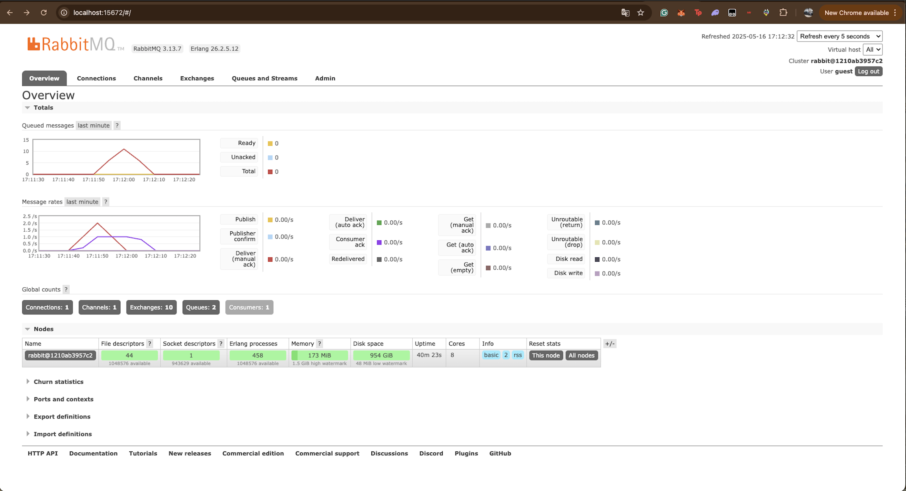
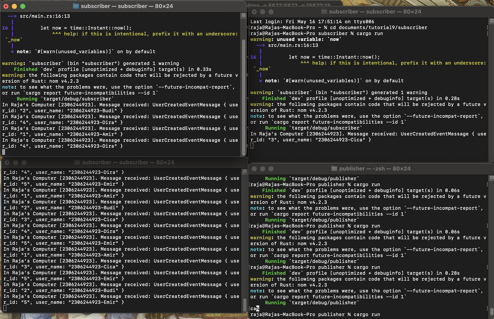

Tutorial 09

1.  a. AMQP merupakan suatu akronim dari Advanced Message Queuing Protocol, ini adalah standar terbuka untuk
protokol application-layer untuk message-oriented middle-ware, yang berarti suatu lapisan software yang memfasilitasi
komunikasi antara aplikasi software dengan cara pertukaran pesan.

    b. URL diatas merupakan koneksi yang akan digunakan oleh RabbitMQ message broker menggunakan AMPQ, untuk guest pertama
merupakan username untuk mengautentikasi RabbitMQ, dan guest kedua merupakan passwordnya. Sedangkan localhost merupakan nama host
dari server RabbitMQ yang tersambung dengan komputer kita. Terakhir, 5672 merupakan nomor port RabbitMQ khusus untuk koneksi AMQP,
dimana 5672 merupakan port inisial dari AMQP 0-9-1, tetapi itu bukan berarti AMQP terbatas pada suatu port yang eksklusif.

Total queue saya adalah 10, perbedaan queue dapat terjadi karena traffic yang dihadapi oleh RabbitMQ server yang berbeda, kemungkinan juga berbeda (Frekuensi cargo run).

Saat tiga terminal subscriber dijalankan secara bersamaan, sistem memiliki lebih banyak konsumen aktif yang bekerja secara paralel untuk menerima dan memproses pesan dari RabbitMQ. Hal ini meningkatkan tingkat konsumsi pesan karena beban kerja dibagi ke lebih banyak proses secara simultan. Akibatnya, laju pemrosesan pesan (message rate) menjadi lebih cepat dibandingkan ketika hanya satu terminal subscriber yang berjalan, karena dalam kasus tersebut hanya ada satu konsumen yang menangani seluruh beban pesan secara berurutan.
